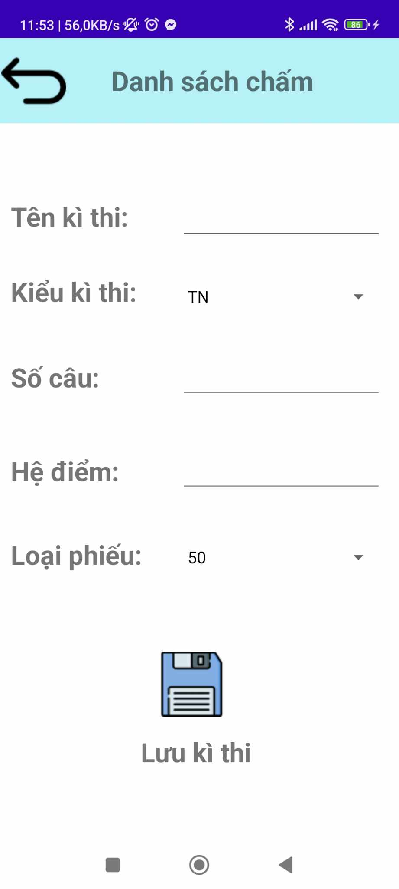
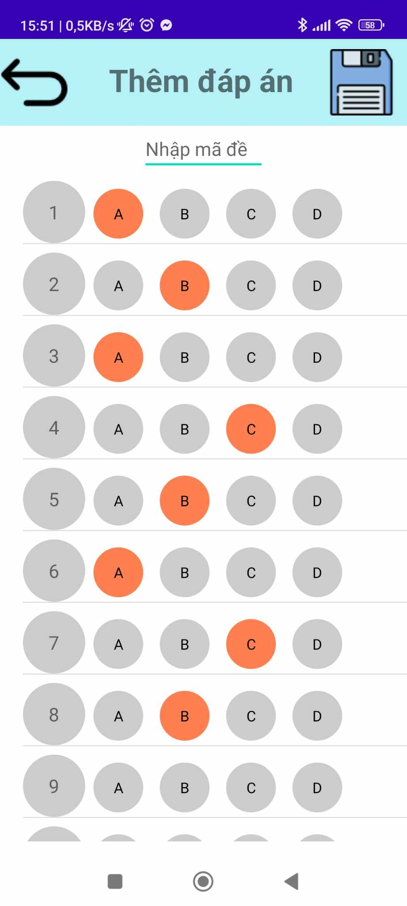
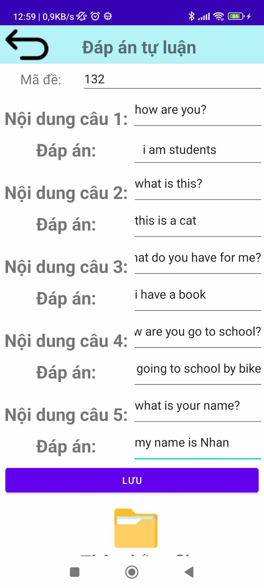
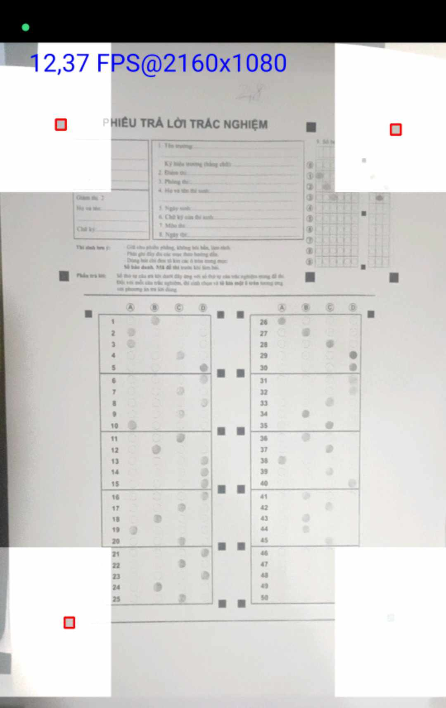
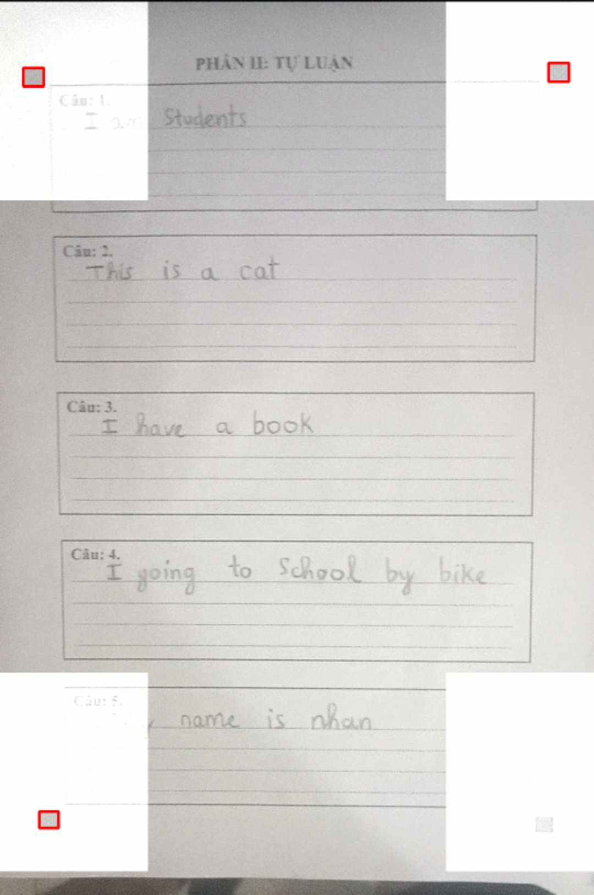
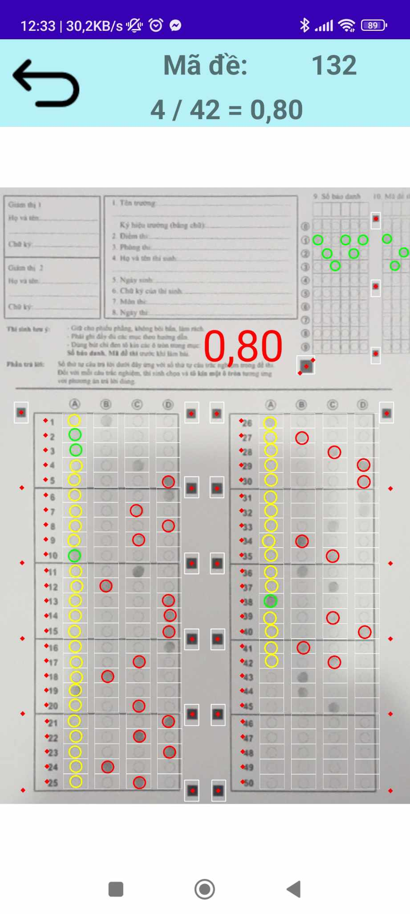
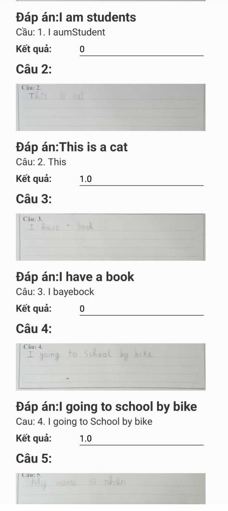
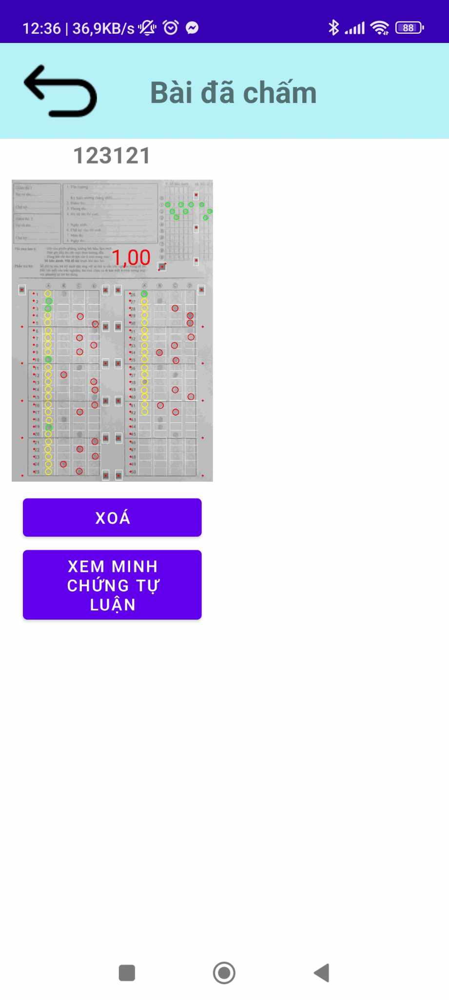
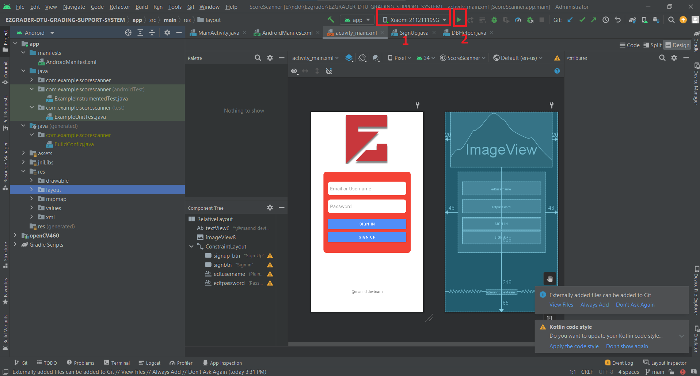

# Ezgrader - DTU Grading Suport System

## Overview

This project is an application designed to assist teachers in grading paper-based exams efficiently. It includes various features to streamline the grading process and provide comprehensive functionality for managing and evaluating exams.

## Features

1. **Sign Up**

   - Allows new users to create an account to access the application.

   

2. **Add New Exam**

   - Enables the addition of new exam sessions for grading.

   

3. **Enter information for the new exam**

   - Enter necessary information for the exam.
   - Click the save button after entering all information
     

4. **Add Multiple Choice Answer**

   - Enter the exam code, then check the correct answers for the exam.
   - Click save answer after adding all the answers
     

5. **Add essay answers**

   - Enter answers to essay questions.
   - Enter the exam code, question, and correct answer
     

6. **Scan and Grade Multiple Choice Questions**

   - Utilizes the camera to scan and automatically grade multiple-choice questions.
     

7. **Scan and score essay questions**

   - Employs the camera to scan and grade written answers.
     

8. **View multiple choice scoring resultss**

   - Permits teachers to review and verify graded papers.
     

9. **View essay scoring results**

   - Permits teachers to review and verify graded papers.
     

10. **View a list of graded exams**
    

## Usage

To use the application, follow these steps:

1. Clone the repository:
   ```bash
    git clone https://github.com/thiennhan04/EZGRADER-DTU-GRADING-SUPPORT-SYSTEM.git
   ```
2. Open the project in Android Studio.

- Build and run the application on an Android emulator or physical device.
  
